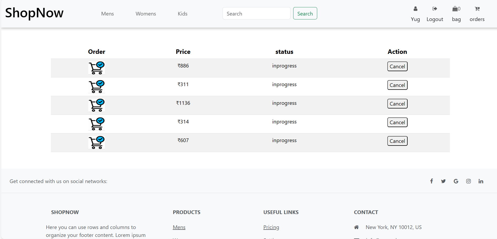

# ShopNowApp

It's E-commerce website Where you can buy stuff especially for Clothing stuff,It's clone of myntra website.

** The Idea**

We are pursuing a Full Stack Web Development course at Masai school, In Masai school, we have given a project to clone myntra website. It was a pretty good project to work on. Let's look at how I designed it

Deployed Link: https://653b81e11bbac15a7811cb0d--illustrious-sunshine-81b980.netlify.app/

## Tech Stack

**Client:** Angular

**Server:** Node.js | Express.js

**Database:** MongoDB

**npm packages:** bcrypt | cors | dotev | express | jsonwebtoken | mongodb | mongoose

**github:** To maintain repository and collabration and version control.

**VS Code:** To write Angular code.

**Google Chrome :** To check the functionality and run the code.

# Getting Started

### Prerequisites

- npm
  ```sh
  npm install
  ```

### Installation

1. Clone the repo

   ```sh
   git clone https://github.com/PallvaKuarweb23/ShopNowE.git
   ```

2. Run api only

   ```sh
   npm start
   ```

3. Open http://localhost:3000 to backend run in the browser

## Frontend Part

- Home Page
- Login/Signup
- Product Page
- Cart Page
- View detail Page
- Checkout Page
- Order Page

## Backend Part

- Authentication using JWT
- Razorpay implementation

## Database

- MongoDB

## Features

- Add to cart
- Filter and search products by color and price
- Buy any product
- User can see orderlist

## Home Page


## Signing Page


## ProductPage Page


## Cart Page


## View Detail Page


## Payment Page


## Razorpay Page


## Order Page



## FAQ

#### Can We login or logout ??

Yes, You Can login or logout

#### Can we add to Cart without login

No, You Can't, first Have to login

#### Is it responsing or not ??

Yes, It's totally responsive

## Support

For support, email pallavakuar93@gmail.com or join our Slack channel.
